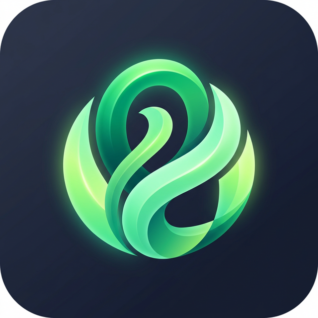

<p align="center">
  
</p>

<h1 align="center">Fodmap Lens</h1>

<p align="center">
  Scan food barcodes and instantly check their FODMAP content.
</p>

<p align="center">
  <a href="https://github.com/M4n0x/fodmap-lens/actions/workflows/ci.yml">
    
  </a>
  <a href="https://github.com/M4n0x/fodmap-lens/releases/latest">
    
  </a>
  
  
</p>

---

## What it does

Fodmap Lens helps people following a low FODMAP diet by scanning product barcodes and analysing the ingredient list against a curated FODMAP database. For each product you get:

- **Overall FODMAP score** (0-100) with traffic light rating
- **Per-category breakdown** across all 6 FODMAP categories (fructans, GOS, lactose, excess fructose, sorbitol, mannitol)
- **Reintroduction groups** (Oligosaccharides, Disaccharides, Monosaccharides, Polyols)
- **Safe serving sizes** when available
- **Ingredient-level matching** with confidence indicator

## Data sources

| Source | Usage |
|--------|-------|
| [Open Food Facts](https://world.openfoodfacts.org/) | Product data (name, brand, image, ingredients) fetched via API on barcode scan |
| [Monash University FODMAP Research](https://www.monashfodmap.com/) | Basis for the bundled FODMAP ingredient database (246 ingredients, manually curated) |

The FODMAP database is shipped locally with the app — no external FODMAP API is called at runtime.

## Features

- Barcode scanning (EAN-13/EAN-8) via device camera
- Manual barcode entry fallback
- Ingredient search with FODMAP group filters (O/D/M/P)
- Scan history with offline viewing
- Multi-language support (English, French, German)
- Persistent language preference

## Tech stack

| Layer | Technology |
|-------|-----------|
| Framework | Expo SDK 55 / Expo Router v4 |
| Language | TypeScript (strict) |
| Scanning | `expo-camera` |
| State | Zustand |
| Async data | TanStack Query v5 |
| Local DB | `expo-sqlite` |
| i18n | `i18next` + `react-i18next` |
| Fuzzy matching | `fuse.js` |
| UI | `react-native-paper` (MD3) |

## Getting started

### Prerequisites

- Node.js 18+
- Android SDK (for building APK)

### Install and run

```bash
# Clone the repo
git clone https://github.com/M4n0x/fodmap-lens.git
cd fodmap-lens

# Install dependencies
npm install

# Start Expo dev server
npx expo start

# Run on Android
npx expo run:android
```

### Run tests

```bash
npx jest
```

### Build release APK

```bash
npx expo prebuild --platform android
cd android
./gradlew assembleRelease
```

The APK will be at `android/app/build/outputs/apk/release/app-release.apk`.

## Download

Grab the latest APK from the [Releases](https://github.com/M4n0x/fodmap-lens/releases/latest) page.

## Disclaimer

This app is provided for **informational purposes only** and does not replace professional medical or dietary advice. FODMAP tolerances vary between individuals. Always consult a qualified dietitian before modifying your diet. Data is based on Monash University research but accuracy is not guaranteed.

## License

[MIT](LICENSE)
